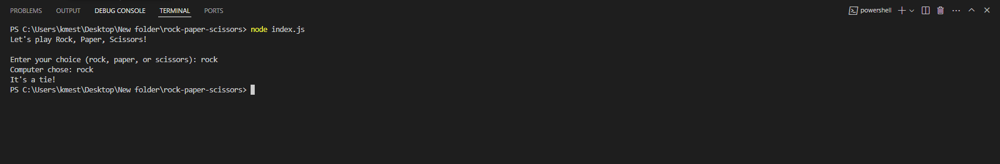

# Rock, Paper, Scissors Game 🪨 📄 ✂️

This is a simple command-line Rock, Paper, Scissors game implemented in JavaScript.

## How to Play 🎮

1. Clone the repository to your local machine:

```bash
git clone https://github.com/your-username/rock-paper-scissors.git
```

2. Navigate to the project directory:

```bash
cd rock-paper-scissors
```

3. Install dependencies:

```bash
npm install
```

4. Start the game:

```bash
node index.js
```

5. Follow the prompts to enter your choice (rock, paper, or scissors) and see the result of the game! 🏆

## Screenshots 📸



## Contributing 🤝

Contributions are welcome! If you have any suggestions or improvements, feel free to open an issue or create a pull request.

## License 📝

This project is licensed under the MIT License - see the [LICENSE](LICENSE) file for details.
